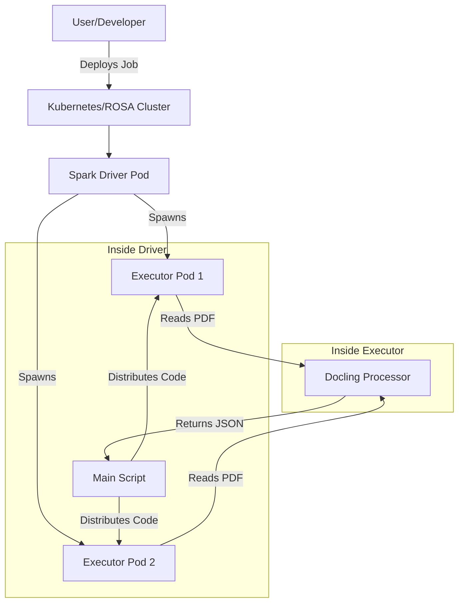

# 📘 Docling + Spark on ROSA: Architecture & Concepts

This document provides a comprehensive technical overview of the **Docling-Spark-Distributed-Structuring** repository. It explains how the system works, the architectural decisions behind the current MVP (Minimum Viable Product), and the roadmap for a production-grade system.

---

## 🏗️ 1. Architecture Overview

This project combines **Docling** (a state-of-the-art PDF processing library) with **Apache Spark** (a distributed computing engine) to process PDF documents at scale on **Red Hat OpenShift Service on AWS (ROSA)**.

### The High-Level Flow




### Key Components

1.  **Spark Driver (`run_spark_job.py`)**: The "brain" of the operation. It:
    *   Starts the SparkSession.
    *   Packages the python module (`docling_module`) into a zip file.
    *   Distributes this zip to all worker nodes (executors).
    *   Scans for PDFs in the assets directory.
    *   Assigns work to executors.
    *   Collects final results and writes them to disk.

2.  **Spark Executors**: The "muscle". They:
    *   Receive the code package and PDF file paths.
    *   Run the heavy `docling` processing (OCR, Layout Analysis, Table Extraction).
    *   Return structured data back to the driver.

3.  **Kubeflow Spark Operator**: A Kubernetes controller that listens for `SparkApplication` resources (YAML files) and manages the lifecycle of the Spark Driver and Executors.

### Namespace Architecture: Separation of Concerns

This system uses **two separate namespaces** following Kubernetes best practices:

#### **Namespace 1: `kubeflow-spark-operator`** (Infrastructure/Control Plane)

**What runs here:**
- `spark-operator-controller` - Watches for `SparkApplication` resources across configured namespaces
- `spark-operator-webhook` - Validates `SparkApplication` manifests before creation

**Why separate:**
- **Separation of concerns** - The operator is infrastructure, not application code
- **Security isolation** - Operator has elevated cluster permissions (create pods, services, etc.)
- **Reusability** - One operator instance manages Spark jobs across multiple application namespaces
- **Lifecycle independence** - Upgrade/restart the operator without affecting running Spark jobs
- **Multi-tenancy** - Different teams can run isolated Spark jobs, all managed by the same operator

#### **Namespace 2: `docling-spark`** (Application/Data Plane)

**What runs here:**
- `SparkApplication` resource - The job definition (YAML manifest)
- `docling-spark-job-driver` - Your Spark driver pod (orchestrates processing)
- `docling-spark-job-exec-*` - Your Spark executor pods (parallel PDF processing)
- `spark-driver` ServiceAccount - Identity with least-privilege permissions

**Why separate:**
- **Application isolation** - Your workload is isolated from operator infrastructure
- **Resource management** - Apply CPU/memory quotas per application namespace
- **RBAC** - Fine-grained permissions (driver can only manage resources in its own namespace)
- **Organization** - Clear boundary between infrastructure and application
- **Easy cleanup** - Delete the namespace to remove all application resources at once

#### **The Interaction Flow**

```
1. User submits SparkApplication YAML → docling-spark namespace
2. Operator Controller detects it → kubeflow-spark-operator namespace
3. Webhook validates the manifest → kubeflow-spark-operator namespace
4. Controller creates Driver Pod → docling-spark namespace
5. Driver spawns Executor Pods → docling-spark namespace
6. Processing happens → docling-spark namespace
7. Results collected → docling-spark namespace
```
```
User submits SparkApplication
         ↓
    (docling-spark namespace)
         ↓
Operator Controller watches for it
         ↓
    (kubeflow-spark-operator namespace)
         ↓
Controller creates Driver Pod
         ↓
    (docling-spark namespace)
         ↓
Driver creates Executor Pods
         ↓
    (docling-spark namespace)
```


**Security benefit:** The `spark-driver` ServiceAccount only has permissions to create/manage pods within `docling-spark`. It cannot access the operator namespace or other application namespaces, following the **principle of least privilege**.

---

## 🧩 2. Deep Dive: The Codebase

### 🐍 `scripts/run_spark_job.py`
This is the entry point. It handles the "Distributed" part of the project.

*   **Code Distribution**: Spark workers are isolated. They don't know the code exists. This script solves that by zipping the `docling_module` and sending it via `spark.sparkContext.addPyFile()`.
*   **The "Sleep Hack"**: To allow manual retrieval of results without persistent storage (PVCs), the script sleeps for 60 minutes after finishing work. This keeps the Driver Pod in a `Running` state so we can run `kubectl cp`.
*   **Result Collection**: Instead of writing to HDFS or S3 (which requires complex setup), the script collects all data back to the Driver (`df.toPandas()`) and writes a single local JSONL file.

### 📄 `scripts/docling_module/processor.py`
This is the "Docling" part. It handles the actual PDF understanding.

*   **Error Handling**: If a PDF is corrupt, we don't want the whole Spark job to crash. This module catches exceptions and returns a "Success: False" result with a full traceback.
*   **Configuration**: Controls thread count, OCR settings, and table extraction.

### 🐳 `Dockerfile`
The custom image `quay.io/rishasin/docling-spark` is built for scale.

*   **Base Image**: `apache/spark-py:latest` (includes Spark & Python).
*   **Multi-Architecture**: Built for `linux/amd64` to run on ROSA nodes (even if built on an Apple Silicon Mac).
*   **Optimization**: Dependencies (`requirements.txt`) are installed *before* copying code to leverage Docker layer caching.
*   **System Libs**: Includes `libgl1` and `tesseract-ocr` required by Docling.
*   **Baked-in Assets**: For this MVP, PDF files are copied directly into `/app/assets` inside the image.

### ☸️ Kubernetes Manifests (`k8s/`)

*   **`deploy.sh`**: The master control script. It handles:
    1.  Namespace creation.
    2.  RBAC setup (permissions).
    3.  **SCC Configuration**: Automatically detects OpenShift and applies `anyuid` SCC to allow the Spark user to run.
    4.  Job submission.
*   **`docling-spark-app.yaml`**: The definition of our job. It tells the Spark Operator:
    *   Which Docker image to use.
    *   How much RAM/CPU to give the Driver and Executors.
    *   The arguments (`--input-dir`, `--output-file`).

---

## 🚀 3. The "MVP" Workflow (Why we do it this way)

We intentionally simplified the workflow to get up and running fast. Here is why we made certain choices:

### Decision 1: Baking PDFs into the Image
*   **Why?** Setting up Shared Persistent Volumes (RWX PVCs) that work across multiple nodes is complex and platform-dependent (NFS, EFS, ODF).
*   **Trade-off**: To change PDFs, we must rebuild the Docker image.
*   **Benefit**: It "just works" everywhere without storage configuration.

### Decision 2: The "Sleep" & `kubectl cp`
*   **Why?** Once a Pod completes (`Succeeded` phase), we cannot execute commands inside it or copy files easily.
*   **Trade-off**: The job takes up resources for 1 hour after finishing.
*   **Benefit**: We can retrieve the `results.jsonl` file with a simple command, avoiding S3/Cloud Storage setup complexity.

### Decision 3: Single JSONL Output
*   **Why?** Spark naturally writes fragmented files (`part-00001`, `part-00002`). This was literally annoying for me (human).
*   **Trade-off**: The driver must have enough RAM to hold the final result in memory before writing.
*   **Benefit**: We got one clean `results.jsonl` file.

---

## 🔮 4. Future Roadmap (Production Ready) -- Highly Recommended

To move from this MVP to a real-world production system, here are the recommended steps:

### Phase 1: Cloud Storage Integration (S3) ☁️
Stop baking PDFs into the image.
*   **Action**: Modify `run_spark_job.py` to read from `s3a://my-bucket/input/` and write to `s3a://my-bucket/output/`.
*   **Benefit**: No need to rebuild Docker image for new PDFs. Unlimited scale.
*   **Requirement**: Add `hadoop-aws` JARs to the Docker image and configure AWS credentials in K8s Secrets.

### Phase 2: Event-Driven Architecture ⚡
Trigger jobs automatically.
*   **Action**: Use AWS Lambda to detect new file uploads in S3 and submit the `SparkApplication` YAML automatically.
*   **Benefit**: Fully automated pipeline. Upload PDF -> Get JSONL.

### Phase 3: Proper PVCs (If not using S3) 💾
If you must run on-prem without object storage.
*   **Action**: Configure a `ReadWriteMany` (RWX) StorageClass (like NFS or Ceph/ODF). Mount this PVC to both Driver and Executors.
*   **Benefit**: Decouples storage from compute without external cloud dependencies.

### Phase 4: Monitoring & Observability 📊
*   **Action**: Enable the Spark History Server in the Spark Operator.
*   **Benefit**: View logs and metrics for completed jobs long after the pods are gone.

---

## 🛡️ Security & OpenShift (ROSA)

Running Spark on OpenShift requires special attention to security.

*   **User IDs**: Standard Docker containers run as `root` (UID 0). OpenShift forbids this by default. We use the `anyuid` Security Context Constraint (SCC) to allow the Spark image (which runs as UID 185) to function correctly.
*   **Service Accounts**: The `spark-driver` ServiceAccount is the identity of your pod. We bind permissions to this account, ensuring least-privilege access.

---

## 📚 Glossary

*   **CRD (Custom Resource Definition)**: Extends Kubernetes with new types. We use `SparkApplication`.
*   **SCC (Security Context Constraints)**: OpenShift's way of controlling pod permissions (like `root` access).
*   **Driver**: The manager process.
*   **Executor**: The worker process.
*   **ROSA**: Red Hat OpenShift on AWS.

