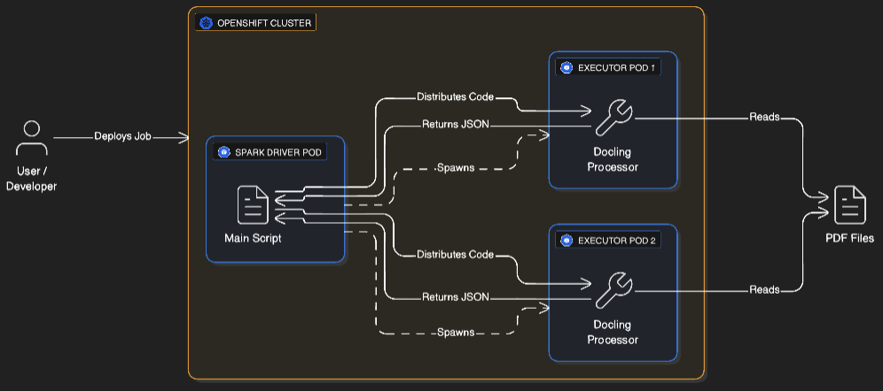

# 🚀 Docling + Spark on ROSA

**Distributed PDF Structure Extraction on OpenShift (Red Hat AI)**

A production-ready system that combines [Docling](https://github.com/DS4SD/docling) (for PDF understanding) with [Apache Spark](https://spark.apache.org/) (for distributed computing) to process thousands of documents in parallel on **Red Hat OpenShift Service on AWS (ROSA)**.

**Note:** This guide prioritizes the `oc` command (OpenShift CLI), but `kubectl` can be used interchangeably.

---

## 🤖 About the `docling-spark` Application
The `docling-spark` application serves as a reference architecture for:
*   **Scale:** processing massive document archives using distributed executors.
*   **Intelligence:** extracting deep structure (tables, layout) using the `docling` library.
*   **Security:** running safely in restricted enterprise environments (OpenShift `restricted-v2`).

---

## 📖 How It Works
1.  **Spark Operator** (running on OpenShift) launches a Driver Pod.
2.  **Driver** distributes Docling code to Executor Pods.
3.  **Executors** process PDFs in parallel (OCR, Layout Analysis, Table Extraction).
4.  **Driver** collects results into a single `results.jsonl` file.
5.  Retrieve the results with a single command.



👉 **[Read the full Architecture & Concepts Guide (Conceptdocs.md)](./Conceptdocs.md)**

---

## ✅ Prerequisites

1.  **OpenShift Cluster**.
2.  **Cluster Admin Setup**: The Kubeflow Spark Operator must be installed by an admin first (see [Installation Guide](#-kubeflow-spark-operator-installation)).
3.  **`oc`** CLI configured.
4.  **Docker** (for building images).
5.  **Quay.io** account (or any container registry).

---

## 🛠️ Kubeflow Spark Operator Installation

> **Pre-requisite:** This section requires **Cluster Admin** privileges. You must install the operator once so that users can submit `SparkApplication` CRDs.

### 1. Prepare the Cluster
```bash
# Log in to your ROSA cluster
oc login

# Install Helm (if not already installed)
brew install helm

# Add the Spark Operator Helm repo
helm repo add spark-operator https://kubeflow.github.io/spark-operator
helm repo update
```

### 2. Prepare Values File

We need to override some default Helm values to ensure:
1.  **Security**: The operator is compatible with OpenShift's `restricted-v2` SCC (letting OpenShift assign User IDs automatically).
2.  **Functionality**: The operator watches **all namespaces** for SparkApplications (crucial for the `docling-spark` namespace to work).

Create a `spark-operator-values.yaml` file (or use the one in the repo):

```yaml
# spark-operator-values.yaml
controller:
  podSecurityContext:
    fsGroup: null  # Override upstream default to let OpenShift SCC assign

webhook:
  enable: true
  podSecurityContext:
    fsGroup: null  # Override upstream default to let OpenShift SCC assign

spark:
  jobNamespaces: []  # Watch all namespaces
```

> **Important:** The `spark.jobNamespaces: []` setting tells the operator to watch **all namespaces**. Without this, the operator won't detect jobs submitted to the `docling-spark` namespace.
>
> **Production Tip:** For better encapsulation and control over permissions, specify a list of allowed namespaces instead of watching all:
> ```yaml
> spark:
>   jobNamespaces:
>     - spark-jobs
>     - analytics
> ```
> This limits where Spark jobs can run and provides better security isolation.
>
> **Zsh Users:** Using this `values.yaml` file is the recommended way to install. It avoids common shell quoting errors (like `zsh: no matches found: spark.jobNamespaces[0]=""`) that occur when passing complex flags directly to Helm.

### 3. Install the Operator

```bash
# Create the namespace
oc new-project kubeflow-spark-operator

# Configure SCC permissions (must be done after namespace creation)
oc apply -f k8s/spark-scc-rolebindings.yaml

# Install via Helm
helm install spark-operator spark-operator/spark-operator \
    --namespace kubeflow-spark-operator \
    -f spark-operator-values.yaml \
    --version 2.2.1
```

> **Version Note:** We use v2.2.1 which includes Spark 3.5.5. Newer versions (v2.3.x+) ship with Spark 4.x which may have breaking changes. See the [version matrix](https://github.com/kubeflow/spark-operator?tab=readme-ov-file#version-matrix) for details.

> **Note:** The `k8s/spark-scc-rolebindings.yaml` binds the operator's ServiceAccounts to the `restricted-v2` SCC, allowing the Spark Operator and its webhooks to run correctly without root privileges. If you use a different namespace, update the namespace references in this file.

### 4. Verify Installation
```bash
oc get pods -n kubeflow-spark-operator
# You should see spark-operator-controller and spark-operator-webhook running
```

---

## ⚡ Quick Start (Deploying the App)

### 1. Choose Your Deployment Path

You have two options depending on your use case:

#### **Option A: Use Pre-Built Image (Recommended for Quick Start)**
The repository is pre-configured to use `quay.io/rishasin/docling-spark:latest`, which contains sample PDFs from the `assets/` directory. This allows you to **skip the build step entirely** and deploy immediately.

Proceed directly to Step 2 (Deploy to ROSA).

---

#### **Option B: Build Your Own Image (For Custom PDFs)**

**Best for:** Processing your own documents, customizing the application, or production deployments.

**Why you need this:** The `assets/` directory is copied into the Docker image at build time (see `Dockerfile` line 47). To process different PDFs, you must rebuild the image with your files.

**Steps:**

1. **Create the assets directory and add your PDFs:**
   ```bash
   mkdir -p assets
   cp /path/to/your/pdfs/*.pdf assets/
   ```

2. **Build the image for ROSA (Linux AMD64):**
   ```bash
   docker buildx build --platform linux/amd64 \
     -t quay.io/YOUR_USERNAME/docling-spark:latest \
     --push .
   ```
   
   > **Note:** The `--platform linux/amd64` flag ensures the image runs on ROSA nodes, even if you're building on Apple Silicon (M1/M2/M3 Mac).

3. **Update the Kubernetes manifest:**
   
   Edit `k8s/docling-spark-app.yaml` and change the image reference:
   ```yaml
   image: quay.io/YOUR_USERNAME/docling-spark:latest  # ← Update this line
   ```

4. **Proceed to Step 2** (Deploy to ROSA).

### 2. Deploy to ROSA
This script handles Namespace, RBAC, and Job Submission.

```bash
chmod +x k8s/deploy.sh
./k8s/deploy.sh
```

### 3. Retrieve Results
Wait for the job to finish (check logs). As soon as you see this is your terminal
```
🎉 ALL DONE!
✅ Enhanced processing complete!
😴 Sleeping for 60 minutes to allow file download...
   Run: oc cp docling-spark-job-driver:/app/output/results.jsonl ./output/results.jsonl -n docling-spark
```
Open another terminal and run the below command to save the results.

```bash
# Copy results to your local machine
oc cp docling-spark-job-driver:/app/output/results.jsonl ./output/results.jsonl -n docling-spark

# View them
head -n 5 output/results.jsonl
```

### 4. Cleanup
```bash
oc delete sparkapplication docling-spark-job -n docling-spark
```
---

## 📂 Repository Structure

*   **`scripts/`**: Python source code.
    *   `docling_module/`: The PDF processing logic.
    *   `run_spark_job.py`: The Spark orchestration script.
*   **`k8s/`**: Kubernetes manifests.
    *   `docling-spark-app.yaml`: The Spark Job definition.
    *   `deploy.sh`: Deployment automation script.
*   **`assets/`**: Place your input PDFs here.
*   **`requirements.txt`**: Dependencies for **local development** (includes PySpark & macOS support).
*   **`requirements-docker.txt`**: Dependencies optimized for the **Docker container** (Linux only).
*   **`Conceptdocs.md`**: **Deep dive into architecture, decisions, and future roadmap.**
*   **`SparkOperatorOnOpenShift.md`**: **Detailed guide on Spark Operator architecture, installation, and debugging on OpenShift.**

---

_See [Conceptdocs.md](./Conceptdocs.md) for the detailed roadmap._
