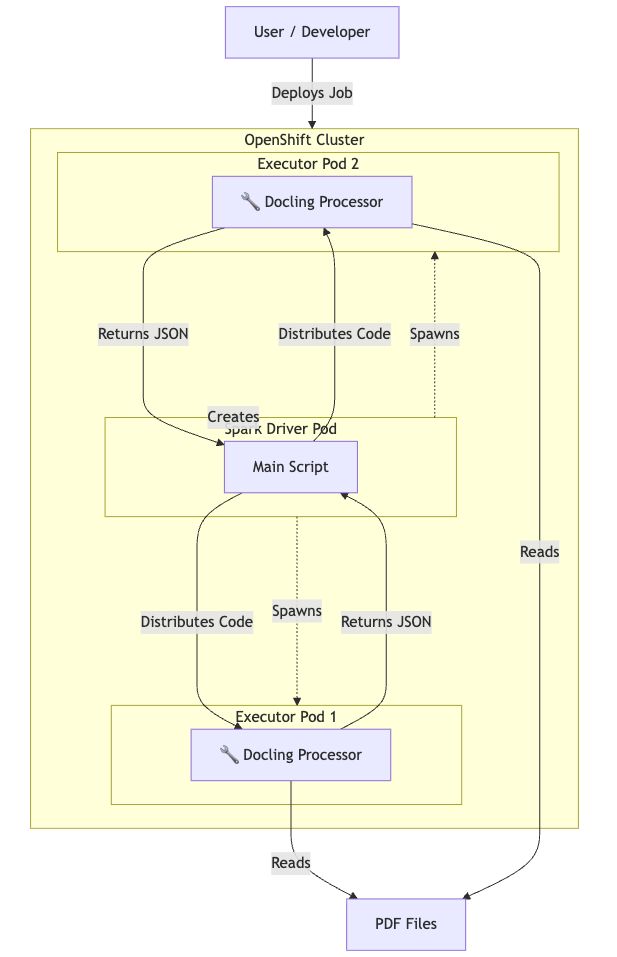

# Kubeflow Spark Operator on Red Hat AI

This documentation details how the Kubeflow Spark Operator works on Red Hat AI, its architecture, installation, and how to run a distributed Spark workload using the `docling-spark` application.

## 1. About Docling-Spark Application

The `docling-spark` application demonstrates a production-grade pattern for processing documents at scale using:
*   **Docling**: For advanced document layout analysis and understanding.
*   **Apache Spark**: For distributed processing across the cluster.
*   **Kubeflow Spark Operator**: For native Kubernetes lifecycle management.

### How Docling-Spark Application Works
1.  **Spark Operator** (running on OpenShift) launches a Driver Pod.
2.  **Driver** distributes Docling code to Executor Pods.
3.  **Executors** process PDFs in parallel (OCR, Layout Analysis, Table Extraction).
4.  **Driver** collects results into a single `results.jsonl` file.
5.  Retrieve the results with a single command.

## 2. SparkApplication CRD

The **SparkApplication** Custom Resource Definition (CRD) is the core abstraction provided by the operator. It allows you to define Spark applications declaratively using Kubernetes YAML manifests, similar to how you define Deployments or Pods.

Key fields in the `SparkApplication` spec include:

*   **`type`**: The language of the application (`Python`).
*   **`mode`**: Deployment mode (`cluster` or `client`). In `cluster` mode, the driver runs in a pod.
*   **`image`**: The container image to use for the driver and executors.
*   **`mainApplicationFile`**: The entry point path (e.g., `local:///app/scripts/run_spark_job.py`).
*   **`sparkVersion`**: The version of Spark to use (must match the image).
*   **`restartPolicy`**: Handling of failures (`Never`, `OnFailure`, `Always`).
*   **`driver` / `executor`**: Resource requests (cores, memory), labels, service accounts, and **security contexts**.

Example snippet from `k8s/docling-spark-app.yaml`:

```yaml
apiVersion: "sparkoperator.k8s.io/v1beta2"
kind: SparkApplication
metadata:
  name: docling-spark-job
spec:
  type: Python
  mode: cluster
  image: quay.io/rishasin/docling-spark:latest
  mainApplicationFile: local:///app/scripts/run_spark_job.py
  driver:
    cores: 1
    memory: "4g"
    serviceAccount: spark-driver
    securityContext:
      runAsNonRoot: true
      seccompProfile:
        type: RuntimeDefault
  executor:
    instances: 2
    memory: "4g"
    securityContext:
      runAsNonRoot: true
      seccompProfile:
        type: RuntimeDefault
```

## 3. Spark Operator Architecture

The Spark Operator follows the standard Kubernetes Operator pattern:

1.  **CRD Controller**: Watches for events (Create, Update, Delete) on `SparkApplication` resources across configured namespaces.
2.  **Submission Runner**: When a `SparkApplication` is created, the operator generates the `spark-submit` command and executes it inside a simplified "submission" pod or internally.
3.  **Spark Pod Monitor**: Watches the status of the Driver and Executor pods and updates the `.status` field of the `SparkApplication` resource.
4.  **Mutating Admission Webhook**: An optional but recommended component that intercepts pod creation requests. It injects Spark-specific configuration (like mounting ConfigMaps or Volumes) into the Driver and Executor pods before they are scheduled.

### Flow on OpenShift

> **Note:** The Operator must be installed by a Cluster Admin before users can submit jobs.

1.  User applies `SparkApplication` YAML.
2.  Operator Controller (running in `kubeflow-spark-operator` namespace) detects the new resource.
3.  Operator creates a **Driver Pod** in the target namespace (e.g., `docling-spark`) via the OpenShift Cluster.
4.  Driver Pod starts and requests **Executor Pods** from the OpenShift Cluster.
5.  Executor Pods start, connect to the Driver, and process the tasks.


## 4. Installation on OpenShift

> **Pre-requisite:** This section requires **Cluster Admin** privileges. You must install the operator once so that users can submit `SparkApplication` CRDs.

Installing the Spark Operator on OpenShift requires Helm and configuring it to work with OpenShift's `restricted-v2` Security Context Constraints (SCC).

### Prerequisites
*   OpenShift CLI (`oc`)
*   Helm CLI (`helm`)
*   Cluster Admin privileges

### Installation Steps

1.  **Prepare the Cluster**:
    ```bash
    oc login
    brew install helm
    helm repo add spark-operator https://kubeflow.github.io/spark-operator
    helm repo update
    ```

2.  **Prepare Values File** (`spark-operator-values.yaml`):
    ```yaml
    controller:
      podSecurityContext:
        fsGroup: null
    webhook:
      enable: true
      podSecurityContext:
        fsGroup: null
    spark:
      jobNamespaces: []  # Watch all namespaces
      # For production, specify allowed namespaces:
      # jobNamespaces:
      #   - spark-jobs
      #   - analytics
    ```
    > **Namespace Control:** Using `jobNamespaces: []` watches all namespaces. For better encapsulation and permission control, specify a list of allowed namespaces where Spark jobs can run.

3.  **Install the Operator**:
    ```bash
    oc new-project kubeflow-spark-operator
    oc apply -f k8s/spark-scc-rolebindings.yaml
    helm install spark-operator spark-operator/spark-operator \
        --namespace kubeflow-spark-operator \
        -f spark-operator-values.yaml \
        --version 2.2.1
    ```
    > **Version Note:** We use v2.2.1 (Spark 3.5.5). See the [version matrix](https://github.com/kubeflow/spark-operator?tab=readme-ov-file#version-matrix) for details.
    
    > **Namespace Note:** If you use a different namespace, update the namespace references in `k8s/spark-scc-rolebindings.yaml` before applying.

5.  **Verify Installation**:
    ```bash
    oc get pods -n kubeflow-spark-operator
    ```

## 5. Debugging and Logging

### Operator Logs
If your Spark jobs are not starting (e.g., no pods created), check the operator logs:

```bash
oc logs -n kubeflow-spark-operator -l app.kubernetes.io/name=spark-operator
```

### Application Logs
Once the Driver pod is created, check its logs for Spark-specific initialization and application output:

```bash
# Check Driver logs
oc logs docling-spark-job-driver -n docling-spark

# Check Executor logs
oc logs docling-spark-job-exec-1 -n docling-spark
```

### SparkApplication Status
Inspect the status of the CRD to see if the operator encountered validation errors or submission failures:

```bash
oc describe sparkapplication docling-spark-job -n docling-spark
```

## 6. Running the Example Workload (Docling + Spark)

This repository contains a complete example of a distributed Spark job that uses the `docling` library to process PDFs.

### Component Overview
*   **`scripts/run_spark_job.py`**: The PySpark driver script. It defines a UDF (User Defined Function) that wraps the `docling` processor.
*   **`Dockerfile`**: Builds a custom Spark image containing `docling`, `tesseract`, and other dependencies.
*   **`k8s/docling-spark-app.yaml`**: The `SparkApplication` definition.



### Running the Job

1.  **Clone the Repository** and navigate to the root.

2.  **Deploy using the Script**:
    The included `deploy.sh` script handles namespace creation, RBAC setup, and job submission.

    ```bash
    ./k8s/deploy.sh
    ```

    **What this script does:**
    *   Creates/Ensures namespace `docling-spark`.
    *   Creates ServiceAccount `spark-driver` and binds necessary roles.
    *   Applies `k8s/docling-spark-app.yaml`.

3.  **Verify Execution**:
    
    Watch the pods start up:
    ```bash
    oc get pods -n docling-spark -w
    ```
    
    You should see:
    *   `docling-spark-job-driver` (Running)
    *   `docling-spark-job-exec-1` (Running)
    *   `docling-spark-job-exec-2` (Running)

4.  **Check Results**:
    The example job processes PDFs in `/app/assets` and saves results to `/app/output/results.jsonl`.
    
    Since this example keeps the driver running for 1 hour after completion (to allow file copy), you can download the results:

    ```bash
    oc cp docling-spark-job-driver:/app/output/results.jsonl ./output/results.jsonl -n docling-spark
    ```

### References
*   [Red Hat Developer: Raw Data to Model Serving](https://developers.redhat.com/articles/2025/07/29/raw-data-model-serving-openshift-ai)
*   [Red Hat Access: Spark Operator on OpenShift](https://access.redhat.com/articles/7131048)
*   [Kubeflow Spark Operator GitHub](https://github.com/kubeflow/spark-operator)
